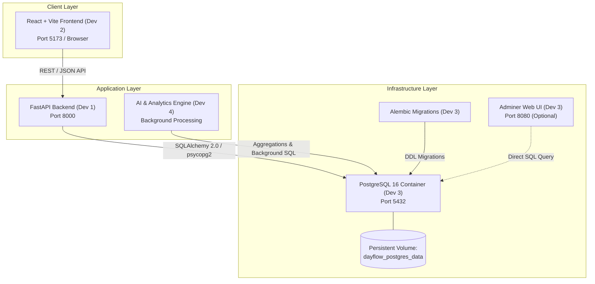

# Dayflow HRMS - System Architecture & Infrastructure

**Document Owner**: Developer 3 (Database + Infrastructure)  
**Project**: Dayflow Human Resource Management System  
**Branch Strategy**: Collaborative single-branch (`main`) workflow  

---

## 1. System Overview

Dayflow HRMS is an enterprise-grade Human Resource Management System built on a modular four-tier architecture. The system enables seamless employee onboarding, profile management, daily/weekly attendance tracking, leave request approval workflows, automated payroll computations, and intelligent analytics.

---

## 2. Developer Team Responsibilities

| Role | Developer | Primary Scope & Directories |
| :--- | :--- | :--- |
| **Backend** | **Developer 1** | `backend/`, FastAPI REST APIs, authentication, JWT tokens, RBAC business logic, Pydantic schemas |
| **Frontend** | **Developer 2** | `frontend/`, React UI, dashboard layouts, employee & HR interfaces, routing, API client integration |
| **Database & Infra** | **Developer 3** | `database/`, `docker-compose.yml`, `.env.example`, `docs/database-schema.md`, PostgreSQL, Alembic |
| **AI & Analytics** | **Developer 4** | `analytics/`, Predictive models, historical data aggregations, notifications, background workers |

---

## 3. Infrastructure & Docker Setup

### 3.1 Container Architecture
- **PostgreSQL 16 Alpine**: Isolated containerized database server. No host installation of PostgreSQL is required on any developer laptop.
- **Healthcheck Enabled**: The container verifies readiness using `pg_isready` before accepting traffic.
- **Docker Compose Networking**: Shared bridge network `dayflow_network` connects all containerized services.
- **Persistent Volume**: `dayflow_postgres_data` persists data across container restarts.

### 3.2 Database Connection Details
- **Container Host**: `postgres` (inside docker network) or `localhost` (from host machine)
- **Port**: `5432`
- **Default Database**: `dayflow_db`
- **Default User**: `dayflow_user`
- **Default Password**: `dayflow_password`

---

## 4. Database Lifecycle & Migrations (Alembic)

1. **Version Controlled DDL**: All schema modifications are recorded in `database/migrations/versions/`.
2. **Deterministic Upgrades**: Any developer or staging environment runs `alembic upgrade head` to reach the exact target schema state.
3. **Idempotent Seeding**: `database/seed.py` provides pre-seeded departments, HR/Admin accounts, sample employees, attendance history, leave requests, and payrolls for rapid development and testing.

---

## 5. Security & Secret Management

- Credentials and sensitive configurations are stored exclusively in `.env`.
- `.env.example` serves as the single source of truth for environment variable templates.
- Real `.env` files and `.pem` keys are strictly ignored by `.gitignore` and never committed to Git.
