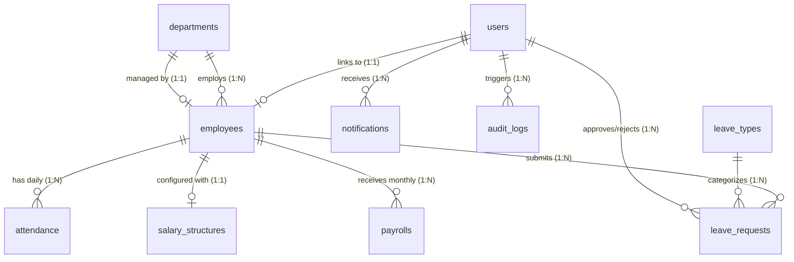

# Dayflow HRMS - Database Schema & Architecture

**Document Owner**: Developer 3 (Database + Infrastructure)  
**Target Audience**: Developer 1 (Backend / FastAPI), Developer 2 (Frontend / UI), Developer 4 (AI / Analytics)  
**Database Engine**: PostgreSQL 16 (via Docker)  
**ORM / Migration Tooling**: SQLAlchemy 2.0+ / Alembic  

---

## 1. Entity-Relationship Architecture



---

## 2. Enumeration Types (Enums)

| Enum Name | Values | Used In |
| :--- | :--- | :--- |
| `user_role_enum` | `'ADMIN'`, `'HR'`, `'EMPLOYEE'` | `users.role` |
| `employment_type_enum` | `'FULL_TIME'`, `'PART_TIME'`, `'CONTRACT'`, `'INTERN'` | `employees.employment_type` |
| `employee_status_enum` | `'ACTIVE'`, `'INACTIVE'`, `'TERMINATED'`, `'ON_LEAVE'` | `employees.status` |
| `attendance_status_enum`| `'PRESENT'`, `'ABSENT'`, `'HALF_DAY'`, `'LEAVE'` | `attendance.status` |
| `leave_status_enum` | `'PENDING'`, `'APPROVED'`, `'REJECTED'`, `'CANCELLED'` | `leave_requests.status` |
| `payroll_status_enum` | `'DRAFT'`, `'PROCESSED'`, `'PAID'` | `payrolls.payment_status` |
| `notification_type_enum`| `'INFO'`, `'LEAVE_STATUS'`, `'ATTENDANCE_ALERT'`, `'PAYROLL_RELEASE'`, `'ANNOUNCEMENT'` | `notifications.type` |

---

## 3. Detailed Table Specifications

### 3.1 `users`
Authentication and security accounts. Supports Section 3.1 (Authentication & Authorization).

| Column | Type | Constraints / Modifiers | Description |
| :--- | :--- | :--- | :--- |
| `id` | `INTEGER` | `PRIMARY KEY`, `AUTOINCREMENT` | Unique user account identifier |
| `email` | `VARCHAR(255)` | `UNIQUE`, `NOT NULL`, `INDEX` | Login email address |
| `password_hash` | `VARCHAR(255)` | `NOT NULL` | Bcrypt hashed password |
| `role` | `user_role_enum`| `NOT NULL`, Default: `'EMPLOYEE'`, `INDEX` | User role (`ADMIN`, `HR`, `EMPLOYEE`) |
| `is_verified` | `BOOLEAN` | `NOT NULL`, Default: `false` | Email verification flag (Req 3.1.1) |
| `is_active` | `BOOLEAN` | `NOT NULL`, Default: `true` | Account active state |
| `created_at` | `TIMESTAMPTZ` | `NOT NULL`, Default: `now()` | Registration timestamp |
| `updated_at` | `TIMESTAMPTZ` | `NOT NULL`, Default: `now()` | Last profile update timestamp |

**Indexes**:
- `ix_users_email`: B-Tree index on `email` (Unique)
- `ix_users_role`: B-Tree index on `role`

---

### 3.2 `departments`
Organizational business units.

| Column | Type | Constraints / Modifiers | Description |
| :--- | :--- | :--- | :--- |
| `id` | `INTEGER` | `PRIMARY KEY`, `AUTOINCREMENT` | Unique department identifier |
| `name` | `VARCHAR(100)` | `UNIQUE`, `NOT NULL` | Department name (e.g. Engineering) |
| `code` | `VARCHAR(20)` | `UNIQUE`, `NOT NULL`, `INDEX` | Short code (e.g. `ENG`, `HR`, `FIN`) |
| `description` | `TEXT` | `NULLABLE` | Description of responsibilities |
| `manager_id` | `INTEGER` | `NULLABLE`, `FK -> employees.id ON DELETE SET NULL` | Assigned department manager |
| `created_at` | `TIMESTAMPTZ` | `NOT NULL`, Default: `now()` | Record creation timestamp |
| `updated_at` | `TIMESTAMPTZ` | `NOT NULL`, Default: `now()` | Record modification timestamp |

**Indexes**:
- `ix_departments_code`: Unique index on `code`

---

### 3.3 `employees`
Core employee profile and job records. Supports Section 3.3 (Employee Profile Management).

| Column | Type | Constraints / Modifiers | Description |
| :--- | :--- | :--- | :--- |
| `id` | `INTEGER` | `PRIMARY KEY`, `AUTOINCREMENT` | Unique employee identifier |
| `user_id` | `INTEGER` | `NULLABLE`, `UNIQUE`, `FK -> users.id ON DELETE SET NULL` | Linked authentication user |
| `employee_code` | `VARCHAR(50)` | `UNIQUE`, `NOT NULL`, `INDEX` | Company employee badge code (e.g. `EMP001`) |
| `first_name` | `VARCHAR(100)` | `NOT NULL` | Given name |
| `last_name` | `VARCHAR(100)` | `NOT NULL` | Family name |
| `email` | `VARCHAR(255)` | `UNIQUE`, `NOT NULL`, `INDEX` | Official company email |
| `phone` | `VARCHAR(30)` | `NULLABLE` | Contact phone number |
| `date_of_birth` | `DATE` | `NULLABLE` | Date of birth |
| `gender` | `VARCHAR(20)` | `NULLABLE` | Gender identity |
| `address` | `TEXT` | `NULLABLE` | Residential address |
| `profile_picture_url` | `VARCHAR(500)` | `NULLABLE` | Avatar / Profile picture URL |
| `department_id` | `INTEGER` | `NULLABLE`, `FK -> departments.id ON DELETE SET NULL`, `INDEX` | Assigned department |
| `designation` | `VARCHAR(100)` | `NOT NULL` | Job title (e.g. Senior Software Engineer) |
| `employment_type` | `employment_type_enum` | `NOT NULL`, Default: `'FULL_TIME'` | `FULL_TIME`, `PART_TIME`, `CONTRACT`, `INTERN` |
| `joining_date` | `DATE` | `NOT NULL` | Date joined organization |
| `status` | `employee_status_enum` | `NOT NULL`, Default: `'ACTIVE'`, `INDEX` | `ACTIVE`, `INACTIVE`, `TERMINATED`, `ON_LEAVE` |
| `documents` | `JSON` | `NULLABLE`, Default: `{}` | JSON metadata for resume, ID proofs, etc. |
| `created_at` | `TIMESTAMPTZ` | `NOT NULL`, Default: `now()` | Profile creation timestamp |
| `updated_at` | `TIMESTAMPTZ` | `NOT NULL`, Default: `now()` | Profile update timestamp |

**Indexes**:
- `ix_employees_employee_code`: Unique index on `employee_code`
- `ix_employees_email`: Unique index on `email`
- `ix_employees_department_id`: Index on `department_id`
- `ix_employees_status`: Index on `status`

---

### 3.4 `attendance`
Daily clock-in/out records. Supports Section 3.4 (Attendance Management).

| Column | Type | Constraints / Modifiers | Description |
| :--- | :--- | :--- | :--- |
| `id` | `INTEGER` | `PRIMARY KEY`, `AUTOINCREMENT` | Unique attendance entry ID |
| `employee_id` | `INTEGER` | `NOT NULL`, `FK -> employees.id ON DELETE CASCADE`, `INDEX` | Target employee |
| `date` | `DATE` | `NOT NULL`, `INDEX` | Attendance calendar date |
| `check_in` | `TIMESTAMPTZ` | `NULLABLE` | Daily check-in timestamp |
| `check_out` | `TIMESTAMPTZ` | `NULLABLE` | Daily check-out timestamp |
| `work_hours` | `NUMERIC(5,2)`| `NULLABLE`, Default: `0.00` | Calculated work hours |
| `status` | `attendance_status_enum`| `NOT NULL`, Default: `'PRESENT'`, `INDEX` | `PRESENT`, `ABSENT`, `HALF_DAY`, `LEAVE` |
| `remarks` | `TEXT` | `NULLABLE` | Check-in note / reason |
| `created_at` | `TIMESTAMPTZ` | `NOT NULL`, Default: `now()` | Entry creation timestamp |
| `updated_at` | `TIMESTAMPTZ` | `NOT NULL`, Default: `now()` | Entry update timestamp |

**Constraints & Indexes**:
- `uq_attendance_employee_date`: `UNIQUE (employee_id, date)` (Prevents duplicate entries per employee/day)
- `ix_attendance_employee_date`: Composite index on `(employee_id, date)` for fast range queries

---

### 3.5 `leave_types`
Configurable leave policies and quotas.

| Column | Type | Constraints / Modifiers | Description |
| :--- | :--- | :--- | :--- |
| `id` | `INTEGER` | `PRIMARY KEY`, `AUTOINCREMENT` | Unique leave type ID |
| `name` | `VARCHAR(100)` | `UNIQUE`, `NOT NULL` | Leave name (e.g. Paid Leave, Sick Leave) |
| `code` | `VARCHAR(20)` | `UNIQUE`, `NOT NULL`, `INDEX` | Policy code (`PAID`, `SICK`, `CASUAL`, `UNPAID`) |
| `days_allowed_per_year`| `INTEGER` | `NOT NULL`, Default: `12` | Annual quota |
| `is_paid` | `BOOLEAN` | `NOT NULL`, Default: `true` | Paid vs Unpaid flag |
| `description` | `TEXT` | `NULLABLE` | Policy explanation |
| `created_at` | `TIMESTAMPTZ` | `NOT NULL`, Default: `now()` | Creation timestamp |
| `updated_at` | `TIMESTAMPTZ` | `NOT NULL`, Default: `now()` | Modification timestamp |

---

### 3.6 `leave_requests`
Employee leave applications and approvals. Supports Section 3.5 (Leave & Time-Off Management).

| Column | Type | Constraints / Modifiers | Description |
| :--- | :--- | :--- | :--- |
| `id` | `INTEGER` | `PRIMARY KEY`, `AUTOINCREMENT` | Unique leave request ID |
| `employee_id` | `INTEGER` | `NOT NULL`, `FK -> employees.id ON DELETE CASCADE`, `INDEX` | Applying employee |
| `leave_type_id` | `INTEGER` | `NOT NULL`, `FK -> leave_types.id ON DELETE RESTRICT`, `INDEX` | Selected leave category |
| `start_date` | `DATE` | `NOT NULL` | Leave commencement date |
| `end_date` | `DATE` | `NOT NULL` | Leave conclusion date |
| `days_count` | `NUMERIC(4,1)`| `NOT NULL` | Duration in days (e.g. `1.0`, `0.5`, `3.0`) |
| `reason` | `TEXT` | `NOT NULL` | Reason for leave |
| `status` | `leave_status_enum`| `NOT NULL`, Default: `'PENDING'`, `INDEX` | `PENDING`, `APPROVED`, `REJECTED`, `CANCELLED` |
| `reviewed_by` | `INTEGER` | `NULLABLE`, `FK -> users.id ON DELETE SET NULL` | Reviewing Admin / HR user ID |
| `review_comments`| `TEXT` | `NULLABLE` | Admin review remarks |
| `reviewed_at` | `TIMESTAMPTZ` | `NULLABLE` | Decision timestamp |
| `created_at` | `TIMESTAMPTZ` | `NOT NULL`, Default: `now()` | Submission timestamp |
| `updated_at` | `TIMESTAMPTZ` | `NOT NULL`, Default: `now()` | Status update timestamp |

**Indexes**:
- `ix_leave_requests_employee_status`: Composite index on `(employee_id, status)`
- `ix_leave_requests_dates`: Composite index on `(start_date, end_date)`

---

### 3.7 `salary_structures`
Compensation formula and allowances/deductions breakdown. Supports Section 3.3.1 and 3.6.2.

| Column | Type | Constraints / Modifiers | Description |
| :--- | :--- | :--- | :--- |
| `id` | `INTEGER` | `PRIMARY KEY`, `AUTOINCREMENT` | Unique salary structure ID |
| `employee_id` | `INTEGER` | `UNIQUE`, `NOT NULL`, `FK -> employees.id ON DELETE CASCADE`, `INDEX` | Linked employee |
| `base_salary` | `NUMERIC(12,2)`| `NOT NULL` | Monthly base compensation |
| `allowances` | `NUMERIC(12,2)`| `NOT NULL`, Default: `0.00` | Sum total allowances |
| `allowances_breakdown`| `JSON` | `NULLABLE`, Default: `{}` | Breakdown: `{"hra": 20000, "transport": 4000, ...}` |
| `deductions` | `NUMERIC(12,2)`| `NOT NULL`, Default: `0.00` | Sum total deductions |
| `deductions_breakdown`| `JSON` | `NULLABLE`, Default: `{}` | Breakdown: `{"tax": 12000, "pf": 5000, ...}` |
| `net_salary` | `NUMERIC(12,2)`| `NOT NULL` | Net payout (`base + allowances - deductions`) |
| `effective_from` | `DATE` | `NOT NULL` | Effective start date |
| `created_at` | `TIMESTAMPTZ` | `NOT NULL`, Default: `now()` | Creation timestamp |
| `updated_at` | `TIMESTAMPTZ` | `NOT NULL`, Default: `now()` | Last revision timestamp |

---

### 3.8 `payrolls`
Historical monthly processed salary slips. Supports Section 3.6 (Payroll/Salary Management).

| Column | Type | Constraints / Modifiers | Description |
| :--- | :--- | :--- | :--- |
| `id` | `INTEGER` | `PRIMARY KEY`, `AUTOINCREMENT` | Unique payslip record ID |
| `employee_id` | `INTEGER` | `NOT NULL`, `FK -> employees.id ON DELETE CASCADE`, `INDEX` | Employee recipient |
| `month` | `INTEGER` | `NOT NULL` | Month integer (`1` - `12`) |
| `year` | `INTEGER` | `NOT NULL` | Year integer (e.g. `2026`) |
| `base_salary` | `NUMERIC(12,2)`| `NOT NULL` | Base salary paid |
| `allowances` | `NUMERIC(12,2)`| `NOT NULL`, Default: `0.00` | Allowances credited |
| `deductions` | `NUMERIC(12,2)`| `NOT NULL`, Default: `0.00` | Deductions debited |
| `net_salary` | `NUMERIC(12,2)`| `NOT NULL` | Final net transferred amount |
| `payment_status` | `payroll_status_enum`| `NOT NULL`, Default: `'DRAFT'`, `INDEX` | `DRAFT`, `PROCESSED`, `PAID` |
| `payment_date` | `DATE` | `NULLABLE` | Payout date |
| `payslip_url` | `VARCHAR(500)` | `NULLABLE` | Generated PDF payslip file path / URL |
| `remarks` | `TEXT` | `NULLABLE` | Payroll notes |
| `created_at` | `TIMESTAMPTZ` | `NOT NULL`, Default: `now()` | Creation timestamp |
| `updated_at` | `TIMESTAMPTZ` | `NOT NULL`, Default: `now()` | Modification timestamp |

**Constraints & Indexes**:
- `uq_payroll_employee_month_year`: `UNIQUE (employee_id, month, year)` (Prevents double payment generation)
- `ix_payroll_period`: Composite index on `(year, month)`
- `ix_payroll_employee_status`: Composite index on `(employee_id, payment_status)`

---

### 3.9 `notifications`
Alerts, time-off notifications, and announcements. Supports Section 6 (Future Enhancements & AI Integration).

| Column | Type | Constraints / Modifiers | Description |
| :--- | :--- | :--- | :--- |
| `id` | `INTEGER` | `PRIMARY KEY`, `AUTOINCREMENT` | Unique notification ID |
| `user_id` | `INTEGER` | `NOT NULL`, `FK -> users.id ON DELETE CASCADE`, `INDEX` | Recipient user |
| `title` | `VARCHAR(255)` | `NOT NULL` | Alert headline |
| `message` | `TEXT` | `NOT NULL` | Notification body |
| `type` | `notification_type_enum`| `NOT NULL`, Default: `'INFO'` | `INFO`, `LEAVE_STATUS`, `ATTENDANCE_ALERT`, `PAYROLL_RELEASE`, `ANNOUNCEMENT` |
| `is_read` | `BOOLEAN` | `NOT NULL`, Default: `false`, `INDEX` | Read status |
| `link` | `VARCHAR(255)` | `NULLABLE` | Front-end route link |
| `created_at` | `TIMESTAMPTZ` | `NOT NULL`, Default: `now()`, `INDEX` | Alert creation timestamp |

**Indexes**:
- `ix_notifications_user_unread`: Composite index on `(user_id, is_read)` for fetching pending alerts

---

### 3.10 `audit_logs`
Security, administrative, and financial event log. Supports Section 6 and Developer 4 analytics.

| Column | Type | Constraints / Modifiers | Description |
| :--- | :--- | :--- | :--- |
| `id` | `INTEGER` | `PRIMARY KEY`, `AUTOINCREMENT` | Unique log entry ID |
| `user_id` | `INTEGER` | `NULLABLE`, `FK -> users.id ON DELETE SET NULL`, `INDEX` | Actor user ID |
| `action` | `VARCHAR(100)` | `NOT NULL`, `INDEX` | Action code (e.g. `SIGN_IN`, `APPROVE_LEAVE`, `UPDATE_SALARY`) |
| `entity_name` | `VARCHAR(100)` | `NOT NULL`, `INDEX` | Affected table (e.g. `leave_requests`, `payrolls`) |
| `entity_id` | `VARCHAR(100)` | `NULLABLE` | Affected record identifier |
| `details` | `JSON` | `NULLABLE` | Payload diff or request metadata |
| `ip_address` | `VARCHAR(45)` | `NULLABLE` | Client IP address |
| `created_at` | `TIMESTAMPTZ` | `NOT NULL`, Default: `now()`, `INDEX` | Timestamp of event |

---

## 4. Developer 1 (Backend & FastAPI) Coordination Guide

### 4.1 Importing Models & Database Sessions
Developer 1 can import all models directly from `database.models` and session dependencies from `database.connection`:

```python
from fastapi import APIRouter, Depends, HTTPException, status
from sqlalchemy.orm import Session

# Import database session dependency
from database.connection import get_db

# Import models and enums
from database.models import (
    User,
    Employee,
    Department,
    Attendance,
    LeaveRequest,
    Payroll,
    UserRole,
    AttendanceStatus,
    LeaveStatus,
)

router = APIRouter(prefix="/employees", tags=["Employees"])

@router.get("/")
def list_employees(db: Session = Depends(get_db)):
    return db.query(Employee).filter(Employee.status == "ACTIVE").all()
```

---

## 5. Developer 4 (AI & Analytics) Aggregation Queries

The schema has been indexed and structured to support high-performance analytical queries:

### 5.1 Attendance Trend & Rate per Department
```sql
SELECT 
    d.name AS department,
    a.date,
    COUNT(CASE WHEN a.status = 'PRESENT' THEN 1 END) AS present_count,
    COUNT(CASE WHEN a.status = 'ABSENT' THEN 1 END) AS absent_count,
    ROUND(AVG(a.work_hours), 2) AS avg_work_hours
FROM attendance a
JOIN employees e ON a.employee_id = e.id
JOIN departments d ON e.department_id = d.id
WHERE a.date >= CURRENT_DATE - INTERVAL '30 days'
GROUP BY d.name, a.date
ORDER BY a.date DESC;
```

### 5.2 Monthly Total Payroll Spend by Department
```sql
SELECT 
    d.name AS department,
    p.year,
    p.month,
    SUM(p.net_salary) AS total_payroll_paid,
    COUNT(p.id) AS employees_paid
FROM payrolls p
JOIN employees e ON p.employee_id = e.id
JOIN departments d ON e.department_id = d.id
WHERE p.payment_status = 'PAID'
GROUP BY d.name, p.year, p.month
ORDER BY p.year DESC, p.month DESC;
```
