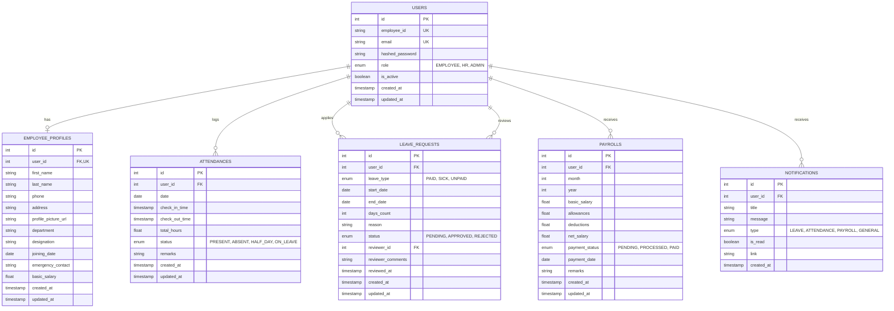

# Dayflow HRMS - Database Schema & ER Design

This document serves as the database specification and contract between **Developer 1 (Backend)** and **Developer 3 (Database + Infrastructure)**.

---

## 1. Entity-Relationship (ER) Overview

---

## 2. Table Specifications

### 1. `users`
| Column | Type | Constraints | Description |
|---|---|---|---|
| `id` | INTEGER | PRIMARY KEY, AUTO_INCREMENT | Internal user identifier |
| `employee_id` | VARCHAR(50) | UNIQUE, NOT NULL, INDEX | Human-readable company ID (e.g. EMP1001) |
| `email` | VARCHAR(255) | UNIQUE, NOT NULL, INDEX | Work email for login |
| `hashed_password` | VARCHAR(255) | NOT NULL | Bcrypt salted hash |
| `role` | VARCHAR(20) | NOT NULL, DEFAULT 'EMPLOYEE' | Role: EMPLOYEE, HR, ADMIN |
| `is_active` | BOOLEAN | NOT NULL, DEFAULT TRUE | Account active status |
| `created_at` | TIMESTAMP WITH TIME ZONE | NOT NULL, DEFAULT UTC | Creation timestamp |
| `updated_at` | TIMESTAMP WITH TIME ZONE | NOT NULL, DEFAULT UTC | Last updated timestamp |

### 2. `employee_profiles`
| Column | Type | Constraints | Description |
|---|---|---|---|
| `id` | INTEGER | PRIMARY KEY, AUTO_INCREMENT | Profile record ID |
| `user_id` | INTEGER | FOREIGN KEY (`users.id`) ON DELETE CASCADE, UNIQUE | Linked user |
| `first_name` | VARCHAR(100) | NOT NULL | First name |
| `last_name` | VARCHAR(100) | NOT NULL | Last name |
| `phone` | VARCHAR(20) | NULLABLE | Contact number |
| `address` | TEXT | NULLABLE | Residential address |
| `profile_picture_url`| VARCHAR(500) | NULLABLE | Avatar URL |
| `department` | VARCHAR(100) | NOT NULL, INDEX | Department (Engineering, HR, etc.) |
| `designation` | VARCHAR(100) | NOT NULL | Job title (e.g. Software Engineer) |
| `joining_date` | DATE | NOT NULL | Date joined company |
| `emergency_contact` | VARCHAR(50) | NULLABLE | Emergency contact details |
| `basic_salary` | NUMERIC(12, 2)| NOT NULL, DEFAULT 0.00 | Base monthly compensation |
| `created_at` | TIMESTAMP WITH TIME ZONE | NOT NULL, DEFAULT UTC | Creation timestamp |
| `updated_at` | TIMESTAMP WITH TIME ZONE | NOT NULL, DEFAULT UTC | Last updated timestamp |

### 3. `attendances`
| Column | Type | Constraints | Description |
|---|---|---|---|
| `id` | INTEGER | PRIMARY KEY, AUTO_INCREMENT | Attendance entry ID |
| `user_id` | INTEGER | FOREIGN KEY (`users.id`) ON DELETE CASCADE | Employee reference |
| `date` | DATE | NOT NULL, INDEX | Work date (YYYY-MM-DD) |
| `check_in_time` | TIMESTAMP WITH TIME ZONE | NULLABLE | In punch |
| `check_out_time` | TIMESTAMP WITH TIME ZONE | NULLABLE | Out punch |
| `total_hours` | NUMERIC(4, 2)| DEFAULT 0.00 | Calculated duration |
| `status` | VARCHAR(20) | NOT NULL, DEFAULT 'PRESENT' | PRESENT, ABSENT, HALF_DAY, ON_LEAVE |
| `remarks` | TEXT | NULLABLE | Employee note / punch memo |
| `created_at` | TIMESTAMP WITH TIME ZONE | NOT NULL, DEFAULT UTC | Creation timestamp |
| `updated_at` | TIMESTAMP WITH TIME ZONE | NOT NULL, DEFAULT UTC | Last updated timestamp |
| **Unique Constraint** | (`user_id`, `date`) | Unique record per employee per day |

### 4. `leave_requests`
| Column | Type | Constraints | Description |
|---|---|---|---|
| `id` | INTEGER | PRIMARY KEY, AUTO_INCREMENT | Leave application ID |
| `user_id` | INTEGER | FOREIGN KEY (`users.id`) ON DELETE CASCADE | Applicant reference |
| `leave_type` | VARCHAR(20) | NOT NULL | PAID, SICK, UNPAID |
| `start_date` | DATE | NOT NULL | Leave start date |
| `end_date` | DATE | NOT NULL | Leave end date |
| `days_count` | INTEGER | NOT NULL | Total business days |
| `reason` | TEXT | NOT NULL | Applicant explanation |
| `status` | VARCHAR(20) | NOT NULL, DEFAULT 'PENDING' | PENDING, APPROVED, REJECTED |
| `reviewer_id` | INTEGER | FOREIGN KEY (`users.id`) NULLABLE | Approver reference (HR/Admin) |
| `reviewer_comments`| TEXT | NULLABLE | Approver remarks |
| `reviewed_at` | TIMESTAMP WITH TIME ZONE | NULLABLE | Decision timestamp |
| `created_at` | TIMESTAMP WITH TIME ZONE | NOT NULL, DEFAULT UTC | Creation timestamp |
| `updated_at` | TIMESTAMP WITH TIME ZONE | NOT NULL, DEFAULT UTC | Last updated timestamp |

### 5. `payrolls`
| Column | Type | Constraints | Description |
|---|---|---|---|
| `id` | INTEGER | PRIMARY KEY, AUTO_INCREMENT | Salary record ID |
| `user_id` | INTEGER | FOREIGN KEY (`users.id`) ON DELETE CASCADE | Employee reference |
| `month` | INTEGER | NOT NULL (1-12) | Pay period month |
| `year` | INTEGER | NOT NULL | Pay period year |
| `basic_salary` | NUMERIC(12, 2)| NOT NULL | Base pay |
| `allowances` | NUMERIC(12, 2)| NOT NULL, DEFAULT 0.00 | Housing, transport, etc. |
| `deductions` | NUMERIC(12, 2)| NOT NULL, DEFAULT 0.00 | Taxes, benefits, etc. |
| `net_salary` | NUMERIC(12, 2)| NOT NULL | Calculated net payout |
| `payment_status` | VARCHAR(20) | NOT NULL, DEFAULT 'PENDING' | PENDING, PROCESSED, PAID |
| `payment_date` | DATE | NULLABLE | Payout release date |
| `remarks` | TEXT | NULLABLE | Payslip notes |
| `created_at` | TIMESTAMP WITH TIME ZONE | NOT NULL, DEFAULT UTC | Creation timestamp |
| `updated_at` | TIMESTAMP WITH TIME ZONE | NOT NULL, DEFAULT UTC | Last updated timestamp |
| **Unique Constraint** | (`user_id`, `month`, `year`) | Unique payslip per period |

### 6. `notifications`
| Column | Type | Constraints | Description |
|---|---|---|---|
| `id` | INTEGER | PRIMARY KEY, AUTO_INCREMENT | Notification ID |
| `user_id` | INTEGER | FOREIGN KEY (`users.id`) ON DELETE CASCADE | Target recipient |
| `title` | VARCHAR(200) | NOT NULL | Brief headline |
| `message` | TEXT | NOT NULL | Notification body |
| `type` | VARCHAR(50) | NOT NULL, DEFAULT 'GENERAL' | LEAVE, ATTENDANCE, PAYROLL, GENERAL |
| `is_read` | BOOLEAN | NOT NULL, DEFAULT FALSE | Read indicator |
| `link` | VARCHAR(255) | NULLABLE | Target frontend navigation link |
| `created_at` | TIMESTAMP WITH TIME ZONE | NOT NULL, DEFAULT UTC | Creation timestamp |
